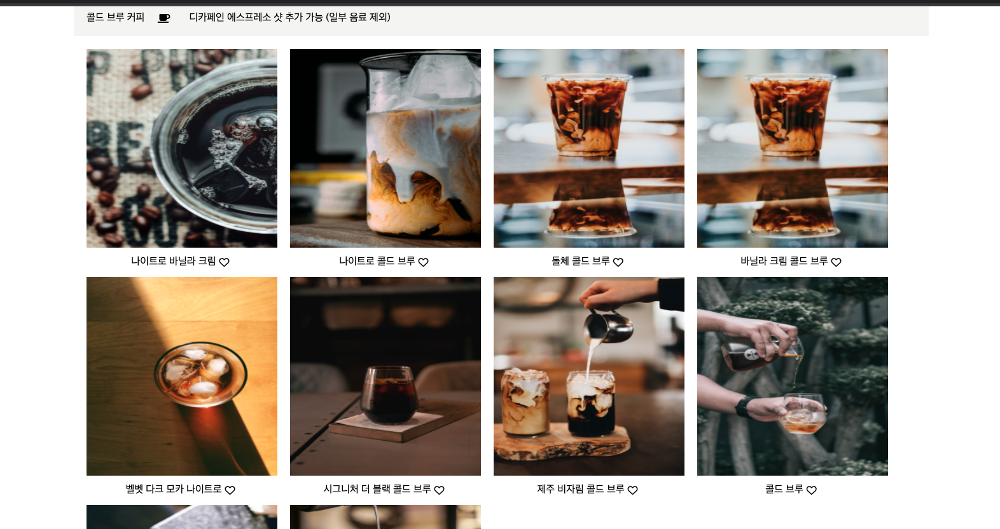

## Mock Data

- Mock data는 백엔드 API 구현 없이 프론트에서 차질없이 개발할 수 있다.
- useEffect 훅에서 fetch 함수로 mock data를 가져올 수 있습니다.
- mock data를 JSON 파일로 만들 수 있습니다. 


```javascript
[
  {
    "id": 1,
    "imgUrl": "/images/jacob-bentzinger-nin2FDduuI0-unsplash.jpg",
    "name": "나이트로 바닐라 크림"
  },
  {
    "id": 2,
    "imgUrl": "/images/amr-taha-2gkWIQW_V34-unsplash.jpg",
    "name": "나이트로 콜드 브루"
  },
  {
    "id": 3,
    "imgUrl": "/images/andrew-valdivia-mMI5sdLFoHM-unsplash (2).jpg",
    "name": "돌체 콜드 브루"
  },
 .....
]

```

이런식으로 json 파일을 배열 형식으로 넣어주고 반복되는 부분에 하나의 컴포넌트로 데이터 값만 바꿔서 사용할 수 있다.

```javascript
const [commentList, setCommentList] = useState([]);  
useEffect(() => {
    fetch("/data/kimyoungseo/listData.json", {
      method: "GET",
    })
      .then((res) => res.json())
      .then((data) => {
        setCommentList(data);
      });
  }, []);
```

​	useEffect를 이용해서 fetch로 get 방식으로 data를 가져와 사용할 수 있다.

​	useState를 이용해서 setCommentList에 json으로 받아온 데이터를 저장한다.

​	data가 배열 형태이기 때문에 stat를 배열로 초기화 해준다. useState([])

```javascript
 <ul className="product">
              {commentList.map((comment) => {
                if (comment.id < 11) {
                  return (
                    <CommentList
                      key={comment.id}
                      img={comment.imgUrl}
                      title={comment.title}
                      name={comment.name}
                    />
                  );
                }
              })}
            </ul>
```

commentList에 데이터가 들어 있기 때문에 map을 이용해서 comment에 객체 값을 받아온다.

CommentList는 ul태그안에 반복되는 li태그들로 값을 넘겨준다.

```javascript
function CommentList(props) {
  return (
    <>
      <li>
        <div className="hidden">
          
        </div>
        <div className="coffeeName">
          <div onClick={goToDetail}>{props.title}</div>
          <i className={iClass} onClick={changeButton}></i>
        </div>
      </li>
    </>
  );
}
```

props를 이용해서 key={comment.id} ,   img={comment.imgUrl}, title={comment.title},  name={comment.name} 보내준 값들을 이용할 수 있다. 

따라서 json 파일에서 받아온 배열 데이터의 양만큼 map을 이용해서 반복하면서 CommentList 컴포넌트에 데이터를 넣어 하나씩 컴포넌트를 만들어 주지 않아도 하나의 컴포넌트로 데이터의 값만 바꿔서 결과물을 만들 수 있다.

​           



이런식으로 컴포넌트는 하나지만 커피 이름과 이미지만 바꿔서 여러개의 li태그를 생성할 수 있다.