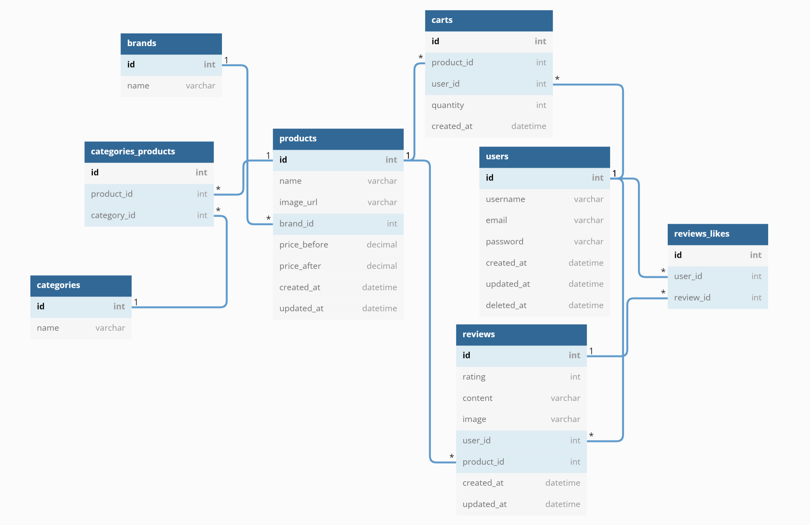
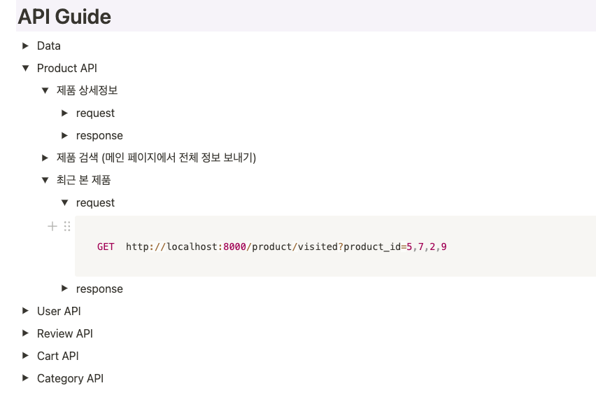

## 1. 프로젝트 소개      

##        

### 소개

- 프로젝트 클론 사이트 :  https://www.aritaum.com/  

- 대표적인 화장품 사이트로 다양한 기능을 가지고 있다.

- 진행기간 : 2022년 4월 18일 ~ 2022년 4월 29일 

- 프로젝트 참여자 : 김연주(B), 송정석(B), 이슬아(F), 김영서(F), 이경원(F
  ), 최정환(F) [back 2명 , front 4명]

- FRONTEND : React, Router, styled-components

- BACKEND : Node.js, Express,  Prisma ,  MySQL , Bcrypt , JWT, cors

- COMMON : RESTful API

  

### 시연 영상

- 아래는 2주간 완성한 프로젝트 시연 영상입니다. 

<iframe width="560" height="315" src="https://www.youtube.com/embed/An_Ny27okSk" title="YouTube video player" frameborder="0" allow="accelerometer; autoplay; clipboard-write; encrypted-media; gyroscope; picture-in-picture" allowfullscreen></iframe>


## 2. 구현 기능


### FRONTEND

- 메인 페이지

  - Nav  검색기능 구현 ( 최근검색어, 검색어 자동완성)
  - Nav  최근본 상품 모달 구현 (상품 상세페이지 들어가면 자동으로 모달 리스트)
  - Nav  장바구니 모달 구현 (장바구니에 담겨 있는 상품 보여줌)

  - 4가지 유형 캐로셀 슬라이드 구현
  - Footer 구현 
  - 페이지 상단으로 올라가는 버튼 구현
  - 유저간 실시간 채팅 기능 구현

- 로그인, 회원가입 페이지

- 검색 페이지

  - 검색된 상품 보여주는 페이지 구현
  - 상품 높은 가격, 낮은 가격, 평점순으로 정렬 가능

- 카테고리 페이지

  - 카테고리에 맞는 상품 보여주는 리스트
  - 평점순, 낮은가격, 높은가격 정렬가능

- 상품 페이지

  - 장바구니에 담는 기능 구현
  - 상품 리뷰 작성, 수정, 삭제, 좋아요 기능 구현
  - 리뷰 정렬 기능

  

### BACKEND

- 회원가입, 로그인 API (validate Token을 이용해서 암호화)
- Category API (카테고리에 맞는 화장품을 보여주는 API)
- 제품 API (상세 페이지에서 제품 정보, 리뷰 수, 평점, 좋아요의 수를 반환)
- 후기 API (multer, fs, path 라이브러리를 이용하여 이미지 업로드)
- 채팅 API (WebSocket 프로토콜을 이용하여 간단한 채팅 기능 구현)


## 3. DB 모델링





## 4. 기록하고 싶은 코드


```javascript
function LatelyModal(props) {
  const [localItem, setLocalItem] = useState(
    localStorage.getItem('itemsViewed') || ''
  );

  const [latelyItem, setLatelyItem] = useState([]);

  const deleteAll = () => {
    setLatelyItem([]);
    setLocalItem('');
    localStorage.setItem('itemsViewed', '');
  };

  const deletItem = id => {
    //fetch로 불러온 값 지우기
    //로컬스토리지에 저장된 값 지우기
    const latelyResult = localItem
      .split(',')
      .filter(local => parseInt(local) !== id)
      .join(',');
    //useState값 삭제
    setLocalItem(latelyResult);
    //로컬스토리지 삭제
    localStorage.setItem('itemsViewed', latelyResult);
    const localResult = latelyItem.filter(lately => lately.id !== id);
    setLatelyItem(localResult);
  };

  useEffect(() => {
    fetch(`http://localhost:8000/product/visited?product_id=${localItem}`, {
      method: 'GET',
    })
      .then(res => res.json())
      .then(data => {
        setLatelyItem(data);
      });
  }, []);
```


최근 본 상품을 보여주는 모달창을 구현하기 위해서 많은 고민을 했다.
제품 상세 페이지에 들어가는 순간 제품의 id 값을 로컬 스토리지에 저장한 다음
로컬스토리지에서 제품의 id 값을 가져오고 그 아이디 값으로 fetch를 해서 db에서 
해당 id의 상품 정보를 가져와서 useState에 넣어주고 모달창에 정보를 보여줬다.

해당 정보를 삭제하기 위해서 로컬스토리지의 정보도 삭제해 주고 useState에 
저장된 값도 함께 삭제 시켜 버튼을 클릭하는 즉시 화면에서 삭제 되도록 코드를 구현했다.


```javascript
const searchValue = e => {
    if (e.key === 'Enter' || e.type === 'click') {
      if (!inputRef.current.value == '') {
        //최근검색어가 11개 이상되면 마지막 값 삭제 후 추가
        if (searchWord.length === 11) {
          searchWord.pop();
          setsearchWord(searchWord);
        }
        //같은 최근 검색어를 또 입력하면 가장 상단으로 옮기고
        //저장되어 있던 단어 삭제
        for (let i = 0; i < searchWord.length; i++) {
          if (searchWord[i].item === inputRef.current.value) {
            searchWord.splice(i, 1);
          }
        }
        setsearchWord(searchWord);
        addSearchWord(inputRef.current.value);
        inputRef.current.value = '';
      }
    }
  };
```


최근 검색어를 저장하는 방식에 대해 고민했다.
검색바의 높이를 고려하여 최대 11개의 검색어만 저장할 수 있도록
설정하고 11개 이상의 검색어를 검색하게 되면 맨 마지막 검색어를 
삭제하는 코드를 구현했다. 
또한 이미 검색한 단어를 다시 검색하면 예전에 검색한 검색어를 
삭제하고 다시 저장하는 코드를 구현했다.
저번 프로젝트에서는 단순히 저장하는 것에만 집중했지만 이번
프로젝트를 통해서 좀 더 디테일한 부분까지 구현할 수 있게 되어 만족했다.


```javascript
  //검색어 자동완성
  useEffect(() => {
    if (inputWord !== '') {
      const result = searchArray.filter(word => {
        return word.name.includes(inputWord);
      });
      setResultSearch(result);
    }
  }, [inputWord]);
```


fetch를 통해서 제품의 모든 정보를 저장하고 입력한 검색어를 filter를
통해서 결과를 찾아와 검색어 자동완성 기능을 구현했다.


```javascript
function ChatModal(props) {
  const date = new Date();
  const hour = date.getHours();
  const minute = date.getMinutes();
  const seconds = date.getSeconds();

  const [chatText, setChatText] = useState([]);
  const textRef = useRef();
  const textArea = useRef();

  const nowTime = hour + '.' + minute + '.' + seconds;

  socket.addEventListener('open', () => {
    console.log('Connected to Server ✅');
  });
  socket.addEventListener('message', msg => {
    setChatText([...chatText, { message: msg.data, date: nowTime }]);

    //스크롤 밑으로
    setTimeout(() => {
      textArea.current.scrollTo(
        0,
        textArea.current.scrollHeight + textArea.current.clientHeight
      );
    }, 0.3);
  });

  function makeMessage(type, payload) {
    const msg = { type, payload };
    return JSON.stringify(msg);
  }

  const pushText = e => {
    if (
      (e.key === 'Enter' || e.type === 'click') &&
      textRef.current.value !== ''
    ) {
      const result = {
        id: arrayKey,
        item: textRef.current.value,
        date: nowTime,
      };
      arrayKey++;
      setChatText(chatText.concat(result));
      socket.send(makeMessage('new_message', textRef.current.value));
      textRef.current.value = '';
      //동시에 진행되서 한박자 느리게 내려가는걸 방지
      setTimeout(() => {
        textArea.current.scrollTo(
          0,
          textArea.current.scrollHeight + textArea.current.clientHeight
        );
      }, 0.3);
    }
  };
```


WebSocket 프로토콜을 이용해서 유저 간의 실시간 채팅을 구현했다.
백에서 보내주는 내용을 조건부 렌더링을 통해서 내가 입력한 채팅과 
상대가 입력한 채팅을 따로 구분하여 보여주고 시간도 넣어 주었다.
채팅을 계속하면 높이가 길어지는 만큼 스크롤이 계속 높이의 아랫부분 
만큼 내려오도록 구현해 줬다.


## 5. 회고

- 프로젝트를 통해 느낀점


### 1. 의사소통

일차 프로젝트를 통해서 의사소통의 중요성에 대해 누구보다
많이 느꼈던 나는 보다 나은 의사소통을 위해서 노력했다.

회의에 적극적으로 참여하고 나의 주장을 할 때는 확실하게 하지만
남의 얘기를 잘 들으려고 노력한 거 같다. 
확실히 1차 보다 나은 의사소통을 한 거 같고 발전할 수 있는 기회가 많다고 생각했다.


### 2.  1차 프로젝트보다 좋은 점

1차 프로젝트 진행시 git에 올라온 pr에 내 코드가 아닌 다른 팀원의 
코드를 꼼꼼하게 살펴보고 코멘트를 남긴 적이 거의 없었다.
2차 프로젝트는 시작부터 그 부분을 잘하기 위해서 노력했다.
백과 프론트 가리지 않고 올라오는 거의 모든 pr의 코드를 확인하고
코멘트를 남겼다. 이 과정을 통해 프로젝트가 좀 더 잘 진행될 수 있었다고
생각되고 코멘트의 의견을 통해 실시간으로 의견이 반영되어 좋았다.




API 가이드를 통해서 백엔드 팀원분들과의 소통이 잘 이루어진 거 같다. 
처음에 작업할 내용을 결정하고 개발을 시작하지만 막상 개발 단계에서
생각나는 API 가 발생할 수도 있고 필요한 데이터들이 생기는 경우가 많았다.
그런 일이 생길 때마다 소통을 통해서 해결했고 바로 반영된 API 가이드를 보고
개발하면 편리하고 빠르게 구현할 수 있었다. 

이번 프로젝트에서는 빠르게 개발할 수 있다고 생각했지만 nav바를 개발하는데 
생각보다 오랜 시간이 소요되어 이 부분은 아쉬웠지만
팀원분들과 오류를 잡고 팀원분의 코드를 보는 시간이 많아서 좋았다.

1차에는 다른 분의 코드를 같이 상의하면서 오류를 수정하거나 
구조를 변경하는 방법이 아닌 내가 합치면서 혼자 수정하는 시간이 많았다.
하지만 이번에는 내가 혼자 다른 분의 코드를 고치는 시간은 거의 없었고
같이 상의하면서 오류를 고치고 코드를 좋은 방향으로 나가기 위해서 
얘기를 하는 시간들이 많아서 좋았고 배우는 점도 많았다.

하지만 진짜 부족한 점도 많다는 생각을 했다.

### 3. 반성

React의 렌더링 개념에 대해 조금 더 정확하게 알게 되었지만 
아직은 완벽하지 못한다고 생각했다.

새로운 기술을 가져와서 사용하고 적용하는 것보다 기본에 충실해야겠다는 
생각을 많이 하게 되었다. 
이번 프로젝트를 통해 부족한 부분들을 알게 되었고 그 부분들에 대해
조금 더 공부를 확실하게 해야겠다.

전 화면을 반응형으로 구현하기 위해서 노력했다.
반응형 작업이 어려운 부분도 많았고 반응형에 대해서도 공부가 더 필요해 보인다. 

 
